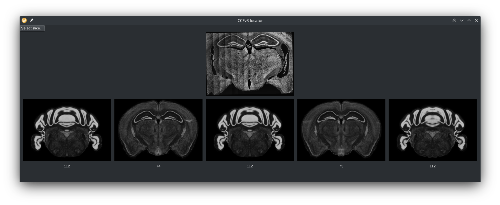

Early work in progress... Not really useful at the moment.




# Installation
Clone the repository
```sh
git clone https://github.com/nickeopti/3d-plane-locator.git
```
and install necessary requirements by
```sh
pip install -r requirements.txt
```

Then ensure necessary atlas file is present/downloaded by running
```sh
make
```
Note that this may take a _long_ time...

Retrieve a trained model file. At the moment, ask @nickeopti for that.


# Usage
Run the application by
```sh
python main.py --model epoch\=242-step\=20169.ckpt --atlas atlas/ara_nissl_10.nrrd --intensity_factor 2
```

> Note that the application is rather limited at the moment. For instance, only (rather non-standardised) 16-bit greyscale `.tiff` images are supported. Also, neither registration nor export options currently exist. There is also a known bug in the image viewer, where images with an odd number of rows will be rendered incorrectly.
